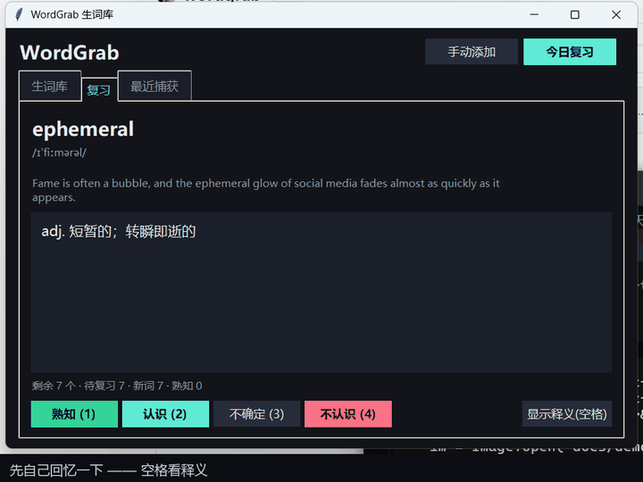
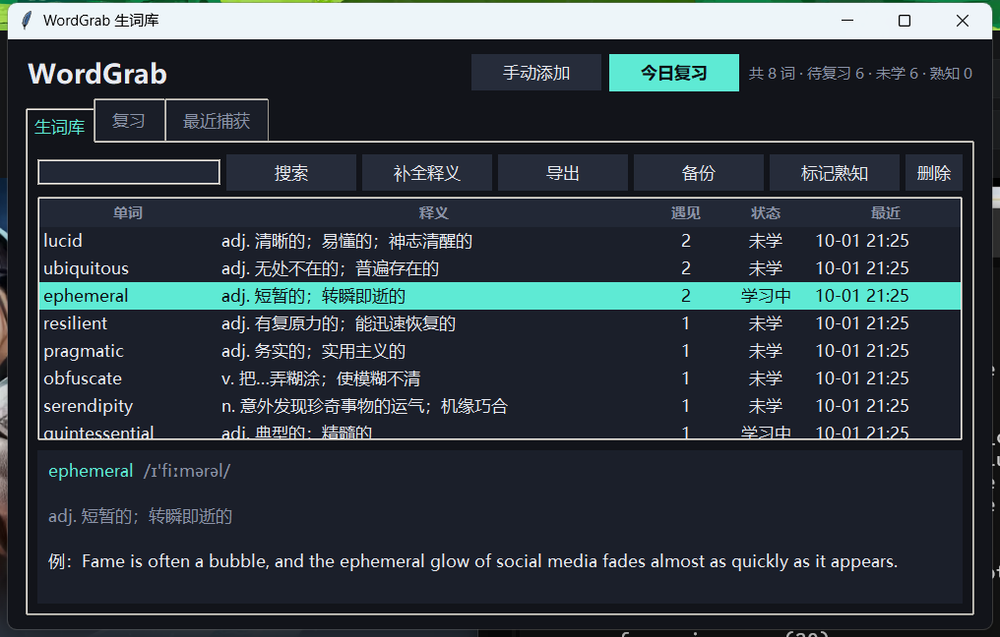

# WordGrab · 阅读时双击取词

[](https://github.com/FireKeymanzz/wordgrab/actions/workflows/ci.yml)
[](LICENSE)
[](https://github.com/FireKeymanzz/wordgrab)
[](requirements.txt)

后台常驻的小工具：**在任意程序里双击一个词，自动收进本地生词库**，并顺手补上释义、上下文出处。

全部数据只在本机 `data/` 目录里，**不上传任何服务器**（唯一的对外请求是向公开词典查释义，不带你的生词内容）。



```
wordgrab/
├─ start.bat          一键安装依赖 + 后台启动
├─ run_tests.bat      跑全部测试（10 组）
├─ wordgrab\          主程序
├─ extension\         Chrome / Edge 扩展 + 内置阅读器
├─ tests\             核心 / 取词 / 端到端 / 界面 / 扩展
└─ data\              首次运行自动创建：words.db（生词库）、config.json、wordgrab.log
```

### English summary

**WordGrab** is a small always-running Windows tool for people who read a lot in
English (or Chinese) and keep forgetting words. Double-click any word **in any
application** — a PDF reader, Word, Notepad, an editor, Obsidian — and it is
captured into a local vocabulary database together with its definition and the
sentence it came from. A built-in four-level spaced-repetition review keeps the
words you actually know from coming back.

- **Capture anywhere**: a low-level mouse hook recognises the double-click;
  the selected text is read via UI Automation, falling back to a simulated
  Ctrl+C (your clipboard is always restored byte-for-byte).
- **Browser extension** (Chrome/Edge) additionally records the whole sentence,
  the page title and the domain — this is the recommended path.
- **Review**: rate yourself 熟知 / 认识 / 不确定 / 不认识
  (known / familiar / unsure / unknown). "Known" retires the word permanently,
  "unsure" shortens the interval, "unknown" drops it into a minutes-scale
  relearning ladder.
- **Private by design**: one SQLite file in `data/`. No account, no sync, no
  telemetry. The only network call is a lookup to a public dictionary API.
- **Yours to keep**: export to Markdown / CSV / Anki TSV / JSON / plain text at
  any time; automatic local backups with one-command restore.
- Requires Windows 10/11 and Python 3.10+. MIT licensed.

---

## 环境要求

| | |
|---|---|
| 系统 | **Windows 10 / 11**（用到了 Win32 鼠标钩子、UIA、托盘，macOS/Linux 跑不了） |
| Python | 3.10 及以上，官方安装包即可（[python.org](https://www.python.org/downloads/windows/)，安装时勾上 *Add python.exe to PATH*） |
| 其它 | 不需要管理员权限；首次运行要联网装依赖 |

---

## 一分钟上手

```bat
git clone https://github.com/FireKeymanzz/wordgrab.git
cd wordgrab
start.bat
```

`start.bat` 会自建 `.venv`、装依赖，然后静默进托盘。不想用 git 就直接
[下载 zip](https://github.com/FireKeymanzz/wordgrab/archive/refs/heads/main.zip) 解压，
双击里面的 `start.bat` 一样。

| 想做什么 | 操作 |
|---|---|
| 打开面板 | `Ctrl+Alt+W` 或双击托盘图标；再双击一次 `start.bat` 也会把它叫到前面 |
| 开始今日复习 | `Ctrl+Alt+R` |
| 手动加词 | `Ctrl+Alt+D`（若被别的软件占用会自动降级，见下） |
| 开机自启 | 托盘菜单 → 开机自启 |
| 临时关掉双击捕获 | 托盘菜单 → 启用双击捕获 |

**用法：正常读书 → 双击不认识的词 → 右下角弹出「+ word」→ 继续读。**

### 截图

上面那段 GIF 是**真实界面录的**（脚本合成按键，没有剪辑）。另外两张：

生词库页：



**单实例**：重复双击 `start.bat` 不会再开一堆托盘图标——新进程会检测到已有实例，直接把它的面板叫到前面然后自己退出。

**热键被占用**：如果 `Ctrl+Alt+D` 这类组合被别的软件先注册了（日志里会写 `could NOT be registered`），会自动降级为 `Ctrl+Alt+Shift+D`，再不行就 `Ctrl+Alt+F9/F10`；实际生效的组合会写进 `data/wordgrab.log`。面板用不了时先看这行。

---

## 三种取词入口

### 1. 全局双击（任意程序：PDF / Word / 记事本 / Obsidian / 编辑器…）

装好即用，不用配。

- 低层鼠标钩子（`WH_MOUSE_LL`）识别双击
- 取词顺序：**UI Automation 选中项** → 失败则 **模拟 Ctrl+C**（剪贴板会原样还原，不会弄丢你复制的东西）
- 自动跳过自己窗口、按住 Ctrl/Alt 的双击、以及输入法/搜索框类窗口
- 自动适配缩放显示器（Per-Monitor DPI V2）

### 2. 浏览器扩展（推荐：能抓到整句和页面来源）

1. 打开 `chrome://extensions`（Edge 是 `edge://extensions`）
2. 打开「开发者模式」→ 「加载已解压的扩展程序」→ 选 `extension` 文件夹
3. 回到网页，双击单词

扩展会连本机 `http://127.0.0.1:8731`，把 **词 + 所在整句 + 域名 + 页面标题** 一起入库，右下角给一个轻量提示。

### 3. 内置阅读器（TXT / MD）

直接浏览器打开：

```
extension/reader.html
```

选文件 → 双击取词。右上角「状态」可看库内统计。适合长文精读，界面比记事体舒服。

---

## 复习

面板切到「复习」页，或按 `Ctrl+Alt+R`（开头那段动图就是这一页）：

- 先只显示单词，**空格**看释义，**1/2/3/4** 打四档（键盘焦点自动落在释义框，直接敲就行）
- 打分后右下角会告诉你这个词被安排到什么时候再出现，不是一个黑箱

| 键 | 档位 | 间隔怎么排 |
|---|---|---|
| 1 | **熟知** | 彻底会了，直接退出复习队列（`status='known'`、`due_at` 置空），以后不再出现 |
| 2 | **认识** | 还记得，低频次露个面：3 → 7.8 → 21 → 56 → 153 天…（按 ease 累乘，封顶 3 年） |
| 3 | **不确定** | 半懂，间隔砍到 40%（最多 3 天），当天内反复判不确定会一直压到 ~5 小时 |
| 4 | **不认识** | 忘了，进重学阶梯：10 分钟 → 30 分钟 → 1.5 → 3 → 6 → 12 小时 → 1 天 → 1.5 天，每多一次「不认识」就往下一档 |

- 「不认识」的词 `due_at` 就在几十分钟后，而队列按 `due_at` 升序取，所以最该回顾的词永远排在最前面
- 顶部统计里的「熟知」是累计毕业数；生词库里选中一行可以「标记熟知 / 取消熟知」（复习页的「熟知」是单向的，这里留了回头路）
- 托盘图标上的角标就是今日待复习数

---

## 数据管理 & 导出

全部数据在程序目录下的 `data/`（可用环境变量 `WORDGRAB_DATA` 指到别处，测试就是这么跑的）：

| 文件 | 作用 | 怎么动 |
|---|---|---|
| `words.db` | 生词库本体（SQLite，5 张表） | **不要直接删**；恢复走 `--restore` |
| `words.db-wal` / `-shm` | SQLite 的 WAL 边车文件 | 别单独动，程序运行时别拷走 |
| `backups/` | **自动备份**（快照 + JSON 镜像） | 只会自动增删，别手动清理 |
| `config.json` | 配置（快捷键、开关、忽略名单） | 可直接编辑，删掉会恢复默认 |
| `wordgrab.log` | 运行日志（512KB×2 滚动） | 出问题先看这里 |
| `.wordgrab-real-data` | 哨兵文件，标记这里是真实数据 | 提醒人别删，测试脚本靠它识别 |
| `ecdict.csv` | 可选：离线词库 | 放进来就优先用它取释义，断网也能用 |

> ⚠️ **测试脚本绝不碰这个目录。** 所有测试都先调 `tests/sandbox.activate()` 把 `WORDGRAB_DATA` 指到临时目录，跑完再调 `verify()` 校验真实库逐字节未变——一旦有任何改动立刻报错。`run_tests.bat` 在跑测试前还会自动快照一次。`test_sandbox_guard.py` 会主动写一次真实目录，确认这道防线真的拦得住。改测试代码前请先读 [CONTRIBUTING.md](CONTRIBUTING.md)。

直接查库（装了 DB Browser for SQLite 或任意 SQLite 工具都能开）：

```sql
-- 最近的 20 个词
SELECT word, definition, hits, status, datetime(last_seen_at,'unixepoch','localtime')
FROM words ORDER BY last_seen_at DESC LIMIT 20;

-- 还没学会的
SELECT word, definition FROM words WHERE status='new' ORDER BY created_at;

-- 已经熟知的（不会再复习）
SELECT word FROM words WHERE status='known' ORDER BY updated_at DESC LIMIT 50;

-- 我在哪本书里遇到过它
SELECT word, source, sentence FROM captures ORDER BY created_at DESC LIMIT 50;

-- 复习历史（grade 取值：known/familiar/unsure/unknown）
SELECT w.word, r.grade, datetime(r.reviewed_at,'unixepoch','localtime')
FROM reviews r JOIN words w ON w.id=r.word_id ORDER BY r.reviewed_at DESC LIMIT 50;
```

### 导出

**面板里点「导出」**最省事：选格式 → 存盘 → 自动打开所在文件夹。

命令行：

```bat
python -m wordgrab --export md                    :: 打印 Markdown 到屏幕
python -m wordgrab --export csv --out D:\生词.csv   :: 存文件（自动补后缀）
python -m wordgrab --export tsv --out D:\anki.tsv
python -m wordgrab --export json --out backup.json  :: 完整数据，可再导入
python -m wordgrab --export txt --out words.txt
python -m wordgrab --export csv --status learning --out 复习中.csv
python -m wordgrab --export csv --status known --out 已熟知.csv
python -m wordgrab --export csv --missing-only --out 待补释义.csv
```

`--out` 传目录（或带结尾分隔符）就自动命名成 `wordgrab-20261001-080212.md`。

| 格式 | 用途 | 说明 |
|---|---|---|
| `md` | **Obsidian / 任何 Markdown** | YAML frontmatter + 表格，带 `wordgrab` 标签，直接丢进 vault |
| `csv` | Excel | UTF-8-BOM，Excel 打开中文不乱码；13 列全字段 |
| `tsv` | **Anki** | 正面词 / 背面释义+例句+出处，已带 `#separator:tab` 等头 |
| `json` | 备份 / 迁移 | 完整字段，可通过 `/import` 导回 |
| `txt` | 背词软件 | 一行一个词，可直接喂给大多数 APP |
| `anki_txt` | Anki 基础版 | `词⇥释义` 两列 |

HTTP（脚本或别的工具取数据）：

```bash
curl "http://127.0.0.1:8731/export?format=md" -o 生词.md
curl "http://127.0.0.1:8731/export?format=csv&download=1" -OJ
curl "http://127.0.0.1:8731/export?format=json"
curl "http://127.0.0.1:8731/export?q=econ&format=txt"      # 按关键词筛
curl "http://127.0.0.1:8731/export?missing=1&format=csv"    # 只导没释义的
curl "http://127.0.0.1:8731/export?status=review&format=tsv"
```

> 例句和「出处」列在**浏览器扩展**捕获时才有内容。纯桌面钩子只知道选中的是哪个词（Chrome 的双击选区用 Ctrl+C 只能复制到单词本身），想要整句就用扩展，或者手动在面板里补 `note`。

### 自动备份

程序有三重保险，都在 `data/backups/`：

| 机制 | 时机 | 产物 |
|---|---|---|
| **启动快照** | 每次启动程序 | `words-20261001-083936-115000.db`（完整库快照，保留最近 20 份） |
| **JSON 镜像** | 每收录一个词（后台）、退出时 | `words-mirror.json`（原子写入，含词 + 复习记录 + 捕获历史） |
| **手动快照** | 面板「备份」按钮或命令行 | 同上 |

快照前会先做 WAL checkpoint，所以拷出来的是一个能独立打开的完整库，不会出现「数据还在但看不见」的情况。镜像用临时文件 + 原子替换，断电也只会丢掉上一份，不会留半个坏文件。

**恢复**：

```bat
python -m wordgrab --backups                  :: 先看看有哪些备份
python -m wordgrab --restore words-mirror.json  :: 恢复（会先自动存一份 pre-restore）
python -m wordgrab --restore words-20261001-083936-115000.db
```

面板里也有：生词库页 →「备份」→ 选中一行 →「恢复选中项」，有二次确认。

> 恢复 `.db` 是整库替换（保留复习进度）；恢复 `words-mirror.json` 是按词合并（会走查重逻辑，更保守）。两种方式在覆盖前都会先给当前内容存一份 `pre-restore` 快照，所以恢复本身也是可逆的。

从别处（另一台机器的 `words.db`、之前导出的 json）把词库搬过来也行：

```bat
python -m wordgrab --restore D:\某处\words.db
```

---

## 配置

`data/config.json`（删掉会恢复默认）：

```jsonc
{
  "capture_enabled": true,          // 全局双击捕获总开关
  "auto_lookup": true,              // 自动补释义
  "double_click_interval_ms": 400,  // 判定双击的时间窗
  "min_word_len": 1,
  "max_word_len": 40,               // 超过这个长度直接忽略（防止选中整段）
  "ignore_apps": ["Windows Input Experience", "TextInputHost", "SearchHost"],
  "notify_on_add": true,            // 右下角气泡提示
  "hotkey_panel": "ctrl+alt+w",
  "hotkey_review": "ctrl+alt+r",
  "hotkey_quick_add": "ctrl+alt+d"
}
```

常用快捷键规则：`ctrl+alt+字母` 或 `ctrl+shift+F5` 这类。

---

## 本地 API

服务跑在 `127.0.0.1:8731`，扩展和任何脚本都能用。

```bash
# 健康检查 / 统计
curl http://127.0.0.1:8731/health

# 入库（自动补释义）
curl -X POST http://127.0.0.1:8731/add \
     -H "Content-Type: application/json" \
     -d '{"word":"ephemeral","sentence":"an ephemeral glow","source":"书籍"}'

# 搜索 / 复习队列 / 打分（level 0=熟知 1=认识 2=不确定 3=不认识）
curl "http://127.0.0.1:8731/words?q=ephe"
curl http://127.0.0.1:8731/review/queue
curl -X POST http://127.0.0.1:8731/review/12 -d '{"level":1}' \
     -H "Content-Type: application/json"
curl -X POST http://127.0.0.1:8731/review/12 -d '{"grade":"不认识"}' \
     -H "Content-Type: application/json"
```

也支持命令行：

```bat
python -m wordgrab --add ubiquitous      :: 查释义并入库
python -m wordgrab --search ephe          :: 命令行查词
python -m wordgrab --review               :: 直接进复习
```

---

## 释义从哪来

按顺序尝试，命中即缓存：

1. **有道词典**（`dict.youdao.com/suggest`，含词性释义，中英都行，无需 key）
2. **ECDICT 离线词库**——把 `ecdict.csv` 放进 `data/` 即可（列名 `word,phonetic,definition,translation`）
3. **dictionaryapi.dev**（英文音标 + 例句）

> 注：`api.dictionaryapi.dev` 在部分网络下会超时，所以放在最后兜底；不影响使用。

---

## 测试

```bat
run_tests.bat
```

| 套件 | 覆盖 | 需要交互桌面 |
|---|---|---|
| `test_core.py` | 词条归一化、查重合并、四档调度（熟知毕业/认识拉长/不确定砍间隔/不认识阶梯）、全部 HTTP 接口、CORS、钩子安装 | |
| `test_export.py` | 导出各格式：字段完整性、CSV 能被 Excel 读、Anki 头部、Markdown 表格与 YAML、筛选（关键词/状态/缺释义）、目录参数、中文 BOM | |
| `test_concurrency.py` | 4 读 + 3 写 + 调度 + 导出共 9 线程同时打数据库：不得出现 `InterfaceError`／`database is locked`；验证每线程独立连接、提交后对新线程可见、并发去重仍正确 | |
| `test_backup.py` | 快照是时间点一致视图、能独立打开；JSON 镜像原子写入且含复习与捕获历史；同秒快照不互相覆盖；超过 20 份自动清理且不误删在用文件；两种恢复方式都能把词找回来 | |
| `test_sandbox_guard.py` | **主动往真实 `data/` 写一次**，确认 `verify()` 一定报错——证明加固不是摆设 | |
| `test_extension.py` | 真实 Chromium 里跑 content.js / reader.js / popup.js：精确双击目标词、重复点击合并、点到标点能归位到相邻词、服务断开时的提示 | |
| `test_capture_win.py` | 真实 Win32 窗口上验证取词：UIA、剪贴板**原样还原**、陈旧剪贴板不误采、**剪贴板被占用时的降级与还原重试**、忽略名单、自窗口跳过 | ✅ |
| `test_e2e_dblclick.py` | 起一个**独立进程**的记事体窗口，合成真实鼠标双击 → 钩子 → 取词 → API → SQLite 全链路；验证重复双击只加次数不重复建行 | ✅ |
| `test_regression_thread.py` | 拉起**真实的 `python -m wordgrab` 进程**，对它打真实双击，断言词进了它的库且日志无异常（专治跨线程崩 Tk 那类问题） | ✅ |
| `test_ui.py` | 面板搜索/详情/复习四档按钮/**模拟真实按键（空格+1/2/3/4）真的能打分**/**搜索框里打字不被抢键**/**最小窗口下底部按钮仍可见**/队列清空/日志、**`tray.start()` 不阻塞主线程**、`build_ui()` 后 `mainloop()` 真的能进、托盘图标与角标、全局热键解析、**后台线程调用面板不崩** | ✅ |

打 ✅ 的四组需要真实鼠标与前台焦点，**CI 上跑不了**（`test_e2e_dblclick` 抢不到焦点时会偶发失败，属正常），
本地跑请确保桌面是激活状态、没有别的程序抢焦点。CI 只跑前五组 + 扩展组。

`test_extension.py` 需要浏览器（首次）：

```bat
pip install -r requirements-dev.txt
python -m playwright install chromium
```

没装也没关系，那一组会自动跳过。

---

## 排障

| 现象 | 处理 |
|---|---|
| 面板打不开 | 按 `Ctrl+Alt+W`；托盘图标 → 打开面板；或再双击一次 `start.bat`（会把已有实例的面板叫出来）。仍不行就看 `data/wordgrab.log` 里 `panel shown:` 那行 |
| 某快捷键没反应 | 日志搜 `could NOT be registered`：说明被别的软件占了，改 `data/config.json` 里的 `hotkey_*` 即可 |
| 双击没反应 | 托盘菜单确认「启用双击捕获」是勾上的；按住 Ctrl/Alt 时本来就不触发；`data/wordgrab.log` 看有没有 `captured` |
| 改了代码没生效 | 有旧实例还在跑（托盘里退，或任务管理器结束 `python.exe`），改完必须重启 |
| 取到的是别的东西 | 看面板「最近捕获」里的 method 与 source；`ignore_apps` 里加上不想抓的程序 |
| 释义是空的 | 面板选中后点「补全释义」；或放 ECDICT 离线词库 |
| 端口被占 | 自动退到 8732/8733/8734，日志里写 `port 8731 was busy`；扩展连的是 8731，需要同步改 `extension/*.js` 里的 `API` |

日志：滚动写入 `data/wordgrab.log`（512KB × 2）。加 `-v` 可以打到控制台。

---

## 已知限制

说清楚免得踩坑：

- **只支持 Windows**。取词靠 `WH_MOUSE_LL` 全局钩子 + UI Automation + 托盘图标，macOS/Linux 需要完全不同的实现。
- **浏览器里整句上下文要用扩展**。桌面钩子只知道选中了哪个词（Chrome 里模拟 Ctrl+C 只能复制到单词本身），想要整句和页面来源就装扩展。
- **词典释义来自第三方公开接口**（有道 suggest / dictionaryapi.dev），可能超时或改接口；离线词库请自己放 `ecdict.csv`。没有 API key，也不需要注册。
- **本地 API 无鉴权**，只监听 `127.0.0.1`。同机的任何程序都能读写你的词库——本机上的恶意软件本来也能直接读那个 `.db` 文件，所以没做额外防护，但别把它暴露到局域网或公网。
- **复习算法是简化的四档调度**，不是 SM-2/FSRS 的完整实现；「熟知」是单向的，只能在生词库里手动取消。
- 单实例锁基于本地端口探测，同时开两个不同目录的副本可能互相抢端口。

---

## 一起把它做好

- 想改点什么 → [CONTRIBUTING.md](CONTRIBUTING.md)（怎么跑测试、`data/` 的铁律、代码约定）
- 报 bug / 要功能 → [开 issue](https://github.com/FireKeymanzz/wordgrab/issues)
- 想参与 → 直接提 PR，CI 会自动跑非 GUI 测试

## 许可证

[MIT](LICENSE) © 2026 FireKeymanzz。拿去改、拿去商用都行，只要保留这份声明。
